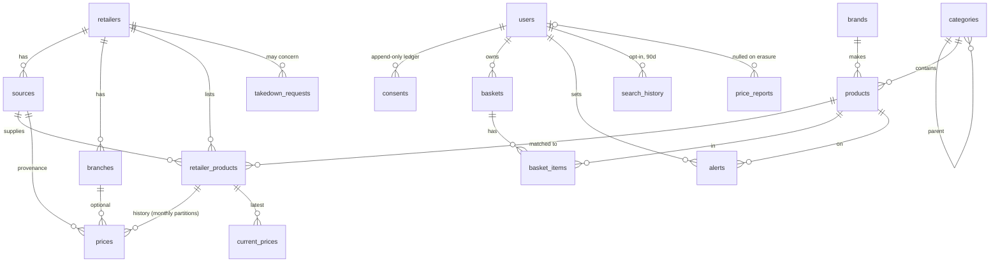

# Data model (plan Phase 2)

Source of truth: `packages/db/migrations/*.sql`. Applied by the in-repo runner
(`pnpm db:migrate`, `pnpm db:down`, `pnpm db:status`); seed with `pnpm seed`.

Not in the diagram: `audit_log` (append-only; sources changes are audited by trigger),
`schema_migrations`.

## Rules enforced in the database (not just in app code)
| Rule | Mechanism |
| ---- | --------- |
| P2: automated source can't be `green` without approval (+ ToS/robots archive for `public_web`) | CHECK constraints on `sources` |
| P2: no price accepted from non-green or kill-switched source | `record_price()` |
| P8: restricted categories/products never public | triggers force `restricted`; `public_products` / `public_offers` views filter it |
| Staleness: hide > 30 days, flag > 7 days | `public_offers` view |
| Unit price per kg / L / piece | `products.base_quantity` (generated) + `current_prices` trigger |
| Older observations never overwrite newer | `record_price()` upsert condition |
| Consent ledger immutable, audit log append-only | triggers |
| Right to erasure / retention | `erase_user()`, `purge_expired_personal_data()`, `receipts_due_for_deletion` |
| Personal data documented | `[PII: purpose]` column comments, checked by a test |

**API and search indexer must read only `public_*` views**, never base tables.

## Open items (carried to later phases)
- Scheduled jobs: `ensure_price_partitions()` monthly, `purge_expired_personal_data()` daily (Phase 3/8/9).
- Separate DB roles for API vs ingestion, read-only role limited to `public_*` (Phase 8).
- Category depth limit (3) is by convention; no DB constraint.
- Staleness thresholds are hard-coded in the view; move to config if they need tuning.
